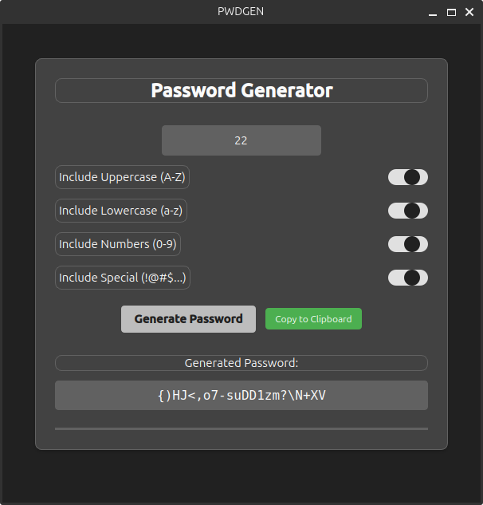

# APT Repository Installation


## Features

- Generates secure 22-character passwords (customizable length)
- Includes random uppercase letters, lowercase letters, numbers, and special characters
- Colorful, user-friendly terminal interface
- Comprehensive error handling and input validation
- Logging system that records operations
- Automatic clipboard integration (requires xclip, pbcopy, or wl-copy)



## Installation Instructions for PwdGen Desktop App


The desktop app can be installed directly using APT. Follow these steps:

#### 1. Add the repository GPG key

```bash
wget -qO- https://zahid4kh.github.io/pwdgen/KEY.gpg | sudo gpg --dearmor -o /usr/share/keyrings/pwdgen-archive-keyring.gpg
```

#### 2. Add the repository to your sources list

```bash
echo "deb [arch=amd64 signed-by=/usr/share/keyrings/pwdgen-archive-keyring.gpg] https://zahid4kh.github.io/pwdgen stable main" | sudo tee /etc/apt/sources.list.d/pwdgen.list
```

#### 3. Update the package list and install PwdGen

```bash
sudo apt update
sudo apt install pwdgen
```

After installation, you can launch the app from your applications menu or by running `pwdgen` in your terminal.

### Dependencies

This application requires:
- Python 3.8 or higher
- PyQt6

These dependencies will be automatically installed when using the APT installation method.

### Uninstalling

To uninstall PwdGen:

```bash
sudo apt remove pwdgen
```

To also remove the repository from your system:

```bash
sudo rm /etc/apt/sources.list.d/pwdgen.list
sudo rm /usr/share/keyrings/pwdgen-archive-keyring.gpg
sudo apt update
```


## License

[LICENSE](LICENSE.txt)

## Author

*Zahid Khalilov*